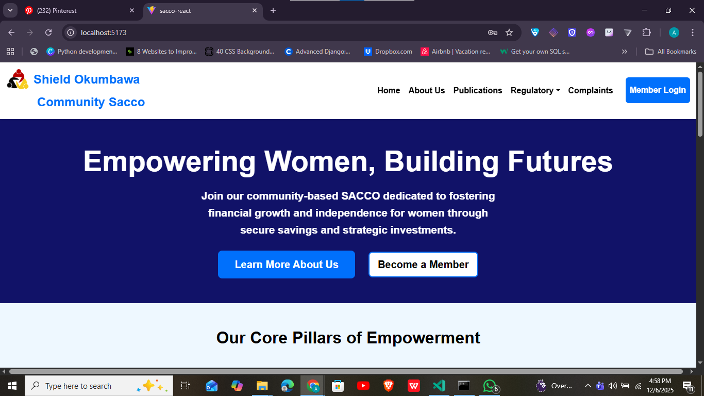
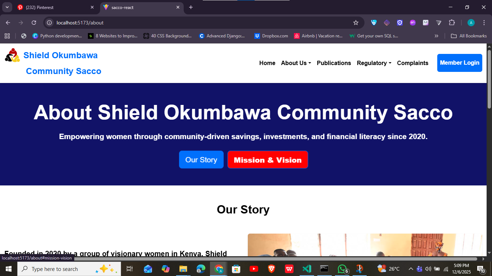
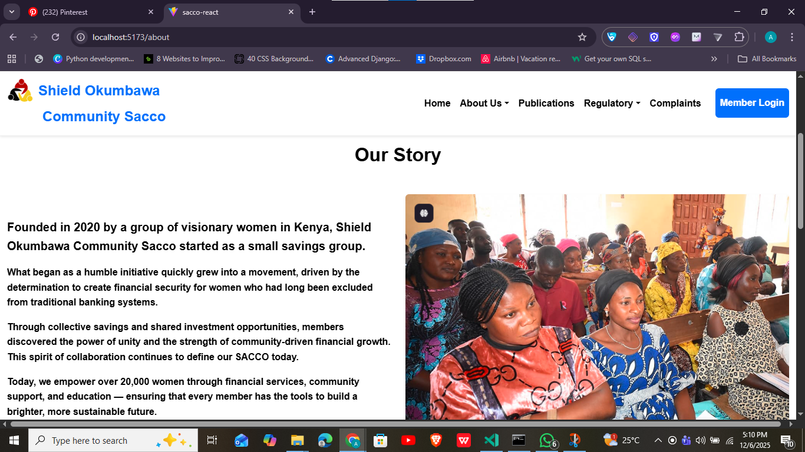
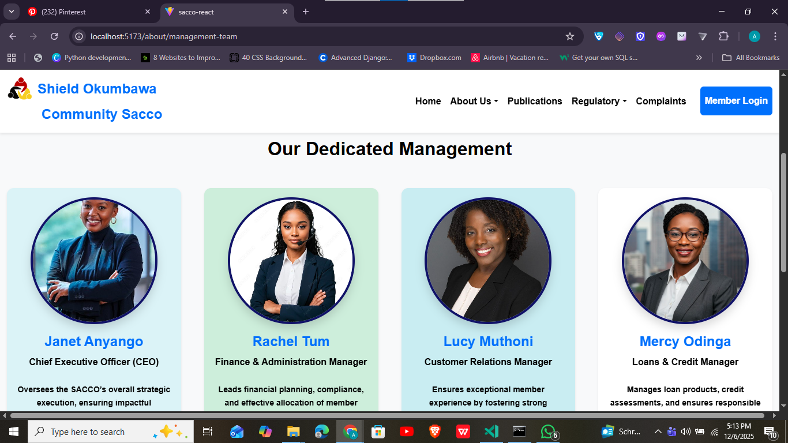
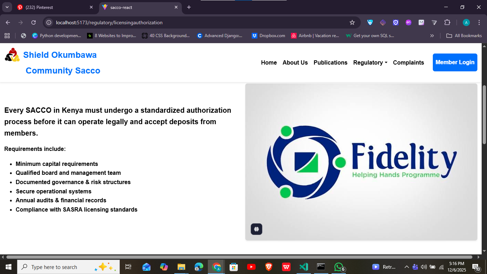
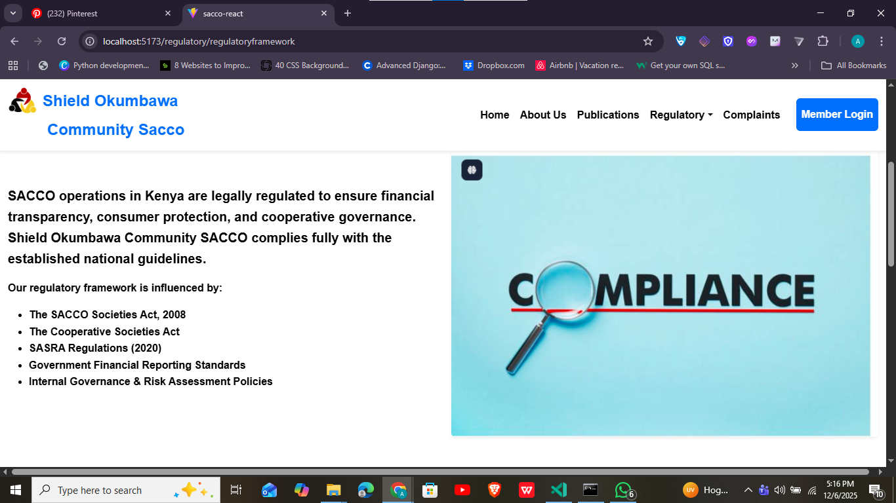
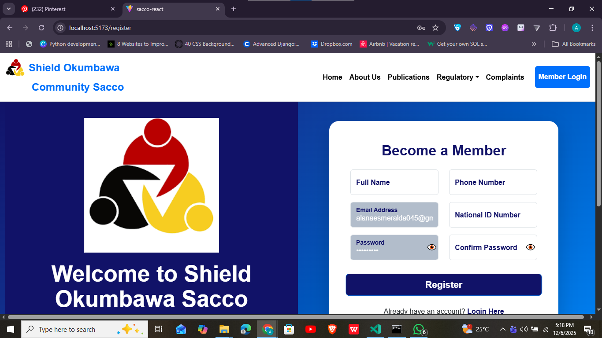
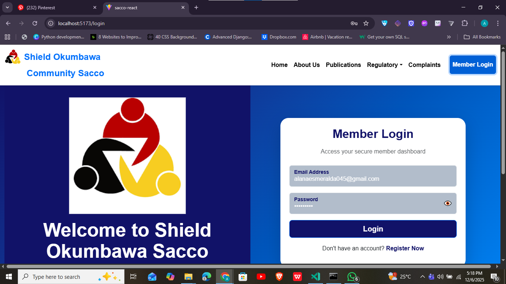

<h1 align="center">🛡️ Shield Okumbawa Community Sacco Website</h1>
<h3 align="center">A Modern Responsive Web Platform Built with Vite + React</h3>

<p align="center">
  
  
  
  
</p>

---

## 📢 Overview

The **Shield Okumbawa Community Sacco Website** is a modern, fast, and responsive platform built using **Vite + React**.  
It provides Sacco members and visitors with an intuitive interface to explore Sacco services, register, log in, and learn more about the organization.

Key highlights:

- Clean and intuitive UI/UX  
- Mobile-first responsive design  
- Smooth animations using Animate.css  
- Fast Vite-powered builds  

---

## ✨ Features

- 🔐 **Member Login & Registration**  
- 🏦 **Sacco Services Information**  
- 👥 **Management Team Profiles**  
- 📝 **About Us & Who We Are Pages**  
- 🧭 **Dynamic Navbar & Routing**  
- ⚡ **Vite-powered fast builds**  
- 📱 **Fully responsive on all devices**  
- 🎨 **Beautiful UI with Bootstrap & Animate.css**  

---

## 🛠️ Tech Stack

| Category | Technologies |
|----------|--------------|
| **Frontend** | React, Vite |
| **Styling** | Bootstrap, CSS3, Animate.css |
| **Routing** | React Router |
| **Tools** | Node.js, npm |
| **Version Control** | Git & GitHub |

---

## 📂 Folder Structure

sacco-react/
│
├── src/
│ ├── components/ # Navbar, Footer, Cards, Buttons
│ ├── pages/ # Home, About, Login, Register, Management
│ ├── styles/ # Global and component-level styles
│ ├── App.jsx
│ └── main.jsx
│
├── public/
│ ├── images/ # Images & logos
│ ├── images/screenshots/ # Project screenshots
├── .gitignore
├── package.json
├── vite.config.js
└── README.md

yaml
Copy code

---

## 🖼️ Screenshots

## 🖼️ Screenshots

<div style="display: flex; flex-wrap: wrap; justify-content: center; gap: 10px;">

  
  
  
  
  
  
  
  
  
  
  

</div>


---

## 🚀 Getting Started

### 1️⃣ Install Dependencies
```bash
npm install
2️⃣ Run Development Server
bash
Copy code
npm run dev
3️⃣ Build for Production
bash
Copy code
npm run build
🌍 Deployment
This project can be deployed to Netlify, Vercel, or GitHub Pages:


📄 License / Usage
© 2025 Shield Okumbawa Community Sacco & Jeff Fortune Amayo. All Rights Reserved

This source code is private and not licensed for public use, modification, or redistribution.

👤 Frontend Web Developer
Jeff Fortune Amayo (Alana303)
GitHub: https://github.com/Alana303
UI/UX Designer & Software Developer

⭐ Support
If you like this project, consider giving it a star ⭐ on GitHub!